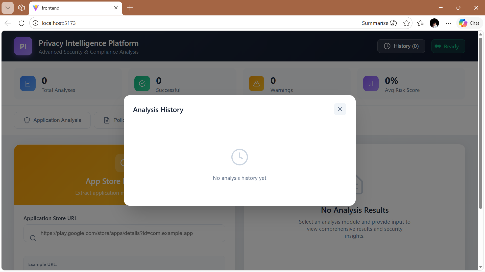
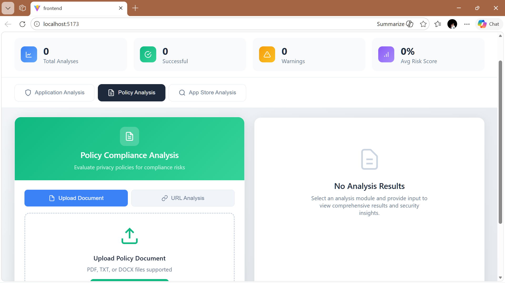

# Privacy Intelligence Platform

Privacy Intelligence Platform is an automated system designed to analyze Android applications and privacy policies to detect potential privacy and security risks.

The platform performs APK permission analysis, privacy policy NLP analysis, and app store metadata extraction to generate comprehensive privacy risk assessment reports.

This system helps users understand how mobile applications access sensitive data and evaluate their privacy implications before installation.

---

# Project Motivation

Mobile applications often request sensitive permissions such as location, contacts, camera, and storage. Many users install applications without understanding the potential privacy implications.

Privacy Intelligence Platform was developed to provide automated analysis of Android applications and privacy policies, enabling users to better understand the risks associated with mobile applications.

The system combines security analysis, policy intelligence, and risk scoring to present clear insights about application behavior.

---

# Key Features

* Android APK permission analysis
* Privacy policy compliance analysis using NLP
* App store metadata intelligence
* Automated privacy risk scoring
* Security report generation
* Visual dashboard for risk insights
* Downloadable analysis reports
* Responsive web interface

---

# System Architecture

User
↓
React Frontend (Dashboard Interface)
↓
Node.js Backend API
↓
Python Analysis Engine

* APK Permission Analyzer
* Privacy Policy NLP Analyzer
* App Store Metadata Scraper
  ↓
  Risk Scoring Engine
  ↓
  Privacy Intelligence Report

---

# System Workflow

1. User uploads an APK file or provides an application store URL.
2. The frontend sends the request to the backend API.
3. The backend processes the request and forwards it to the analysis engine.
4. The Python analyzer extracts APK permissions and metadata.
5. Privacy policy text is analyzed using NLP techniques.
6. Risk scoring engine evaluates security and privacy risks.
7. Results are displayed through an interactive dashboard.
8. Users can download a structured analysis report.

---

# Tech Stack

Frontend

* React.js
* Tailwind CSS
* Vite

Backend

* Node.js
* Express.js

Analysis Engine

* Python
* Flask
* Androguard
* Natural Language Processing

Tools

* Git
* GitHub
* REST APIs

---

# Project Structure

privacy-intelligence-platform

frontend                React web interface
server                  Node.js backend API
analyzer                Python APK and policy analysis engine
docs                    UML diagrams and documentation
uploads                 Temporary uploaded files
reports                 Generated analysis reports

---

# Installation Guide

Prerequisites

* Node.js (v16 or higher)
* Python 3.8+
* npm or yarn
* pip

---

# Setup Python Analyzer

cd analyzer
python -m venv venv

Activate environment

Windows

venv\Scripts\activate

Linux / Mac

source venv/bin/activate

Install dependencies

pip install -r requirements.txt

---

# Setup Node.js Backend

cd server
npm install

---

# Setup React Frontend

cd frontend
npm install

---

# Running the Application

Start Python Analyzer

cd analyzer
python app.py

Runs on
http://localhost:5000

Start Backend

cd server
npm start

Runs on
http://localhost:3001

Start Frontend

cd frontend
npm run dev

Runs on
http://localhost:5173

---

# Risk Scoring System

The system calculates privacy risk scores based on permission categories.

Normal Permissions
Low risk permissions such as network access and vibration.

Dangerous Permissions
Permissions requiring user approval such as location, contacts, storage, camera, and microphone.

Special Permissions
High risk permissions requiring additional authorization such as system overlay and usage access.

Risk Levels

0 – 30   → Low Risk
31 – 60  → Medium Risk
61 – 100 → High Risk

---
## 📸 Application Screenshots

### APK Analysis Dashboard
This screen shows the APK permission analysis interface where users upload APK files and view detected permissions and risk scores.

---

### Application Information
Displays metadata extracted from the Android application including package details and other information.

---

### Analysis History
Shows previously performed analysis results and history of analyzed applications.

---

### Privacy Policy Analysis Using URL
Allows users to analyze privacy policies by providing the policy URL. The system extracts and evaluates privacy statements.

---

### Privacy Policy Compliance Dashboard
Displays privacy compliance analysis results and highlights red flags and green flags in the policy.

---

# Supported Analysis

The platform supports analysis of the following information

* Android application metadata
* Permission extraction from AndroidManifest.xml
* Privacy policy statements
* App store metadata
* Privacy risk scoring

---

# Testing

Health Check

curl http://localhost:3001/api/health

Upload APK Test

curl -X POST -F "apkFile=@sample.apk" http://localhost:3001/api/upload-apk

---

# Deployment

Frontend can be deployed using

* Vercel
* Netlify

Backend can be deployed using

* Render
* Railway
* Heroku

Python analysis engine can be deployed on

* Render
* Railway
* Docker container

---

# Future Improvements

* Machine learning based risk prediction
* Dynamic runtime malware detection
* Multi-store application analysis
* Developer reputation scoring
* Batch APK analysis
* User authentication and dashboards

---

# Author

RAVULA.CHAITANYA SIVA KRISHNA
B.Tech Computer Science Engineering

---

# Contact

Email
[rchaitanyasivakrishna@gmail.com](mailto:rchaitanyasivakrishna@gmail.com)

